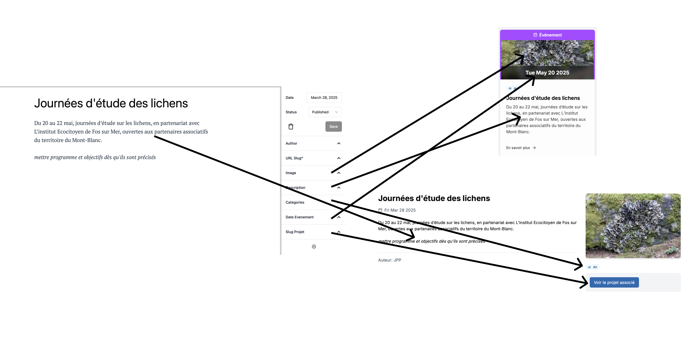
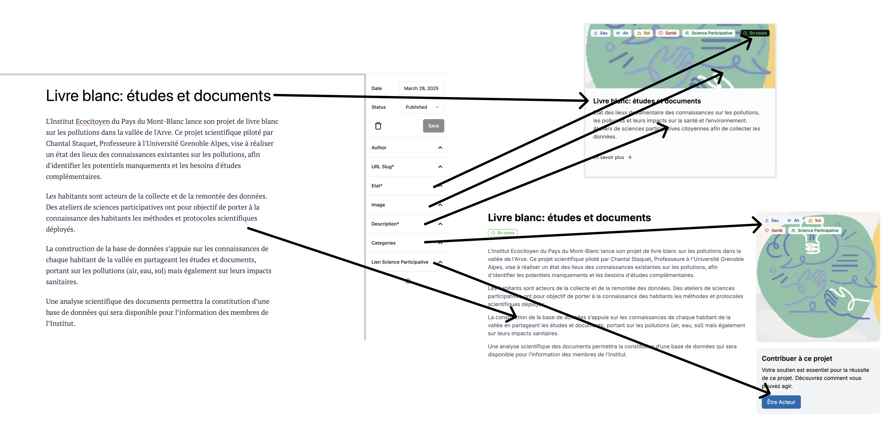

# Institut Ecocitoyen du Pays du Mont Blanc

## Comment mettre à jour le contenu du site web?

### Accès à l'editeur de contenu

L'éditeur de contenu se trouve à l'adresse suivante: https://institut-ecocitoyen-pmb.fr/outstatic.

Seules certaines personnes y ont accès. Pour se faire, suivre la procédure suivante:

1. Créer un compte sur [GitHub](https://github.com/signup)
2. Envoyer le nom d'utilisateur à Mathieu par email
3. Accepter l'invitation reçu par email pour rejoindre l'organisation sur GitHub

Vous pourrez maintenant vous connecter sur l'editeur de contenu.

### Editer du contenu

Il existe plusieurs catégories de contenu, regroupées par "Collection".

Seules 2 sont peuvent être éditées sans soucis (les autres peuvent potentiellement demander des mises à jours du code source du site et sont à voir avec Mathieu):

- les actualitées
- les projets

Chacunes des deux collections contiennent des données structurées qui apparaissent sur le site:

#### Actualité



#### Projet



## Developers

First, run the development server:

```bash
npm run dev
# or
yarn dev
# or
pnpm dev
# or
bun dev
```

Open [http://localhost:3000](http://localhost:3000) with your browser to see the result.

You can start editing the page by modifying `app/page.tsx`. The page auto-updates as you edit the file.

## Learn More

To learn more about Next.js, take a look at the following resources:

- [Next.js Documentation](https://nextjs.org/docs) - learn about Next.js features and API.
- [Learn Next.js](https://nextjs.org/learn) - an interactive Next.js tutorial.

You can check out [the Next.js GitHub repository](https://github.com/vercel/next.js) - your feedback and contributions are welcome!

## Deploy on Vercel

The easiest way to deploy your Next.js app is to use the [Vercel Platform](https://vercel.com/new?utm_medium=default-template&filter=next.js&utm_source=create-next-app&utm_campaign=create-next-app-readme) from the creators of Next.js.

Check out our [Next.js deployment documentation](https://nextjs.org/docs/app/building-your-application/deploying) for more details.
