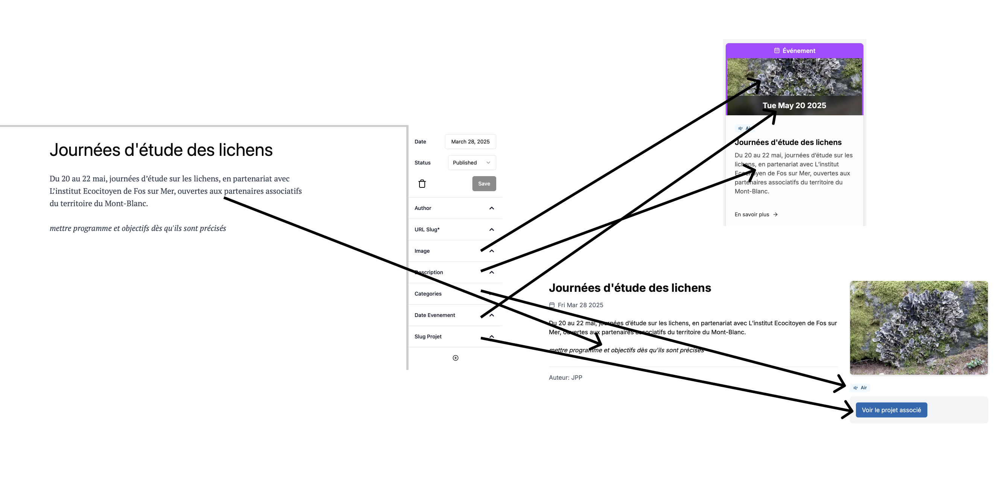
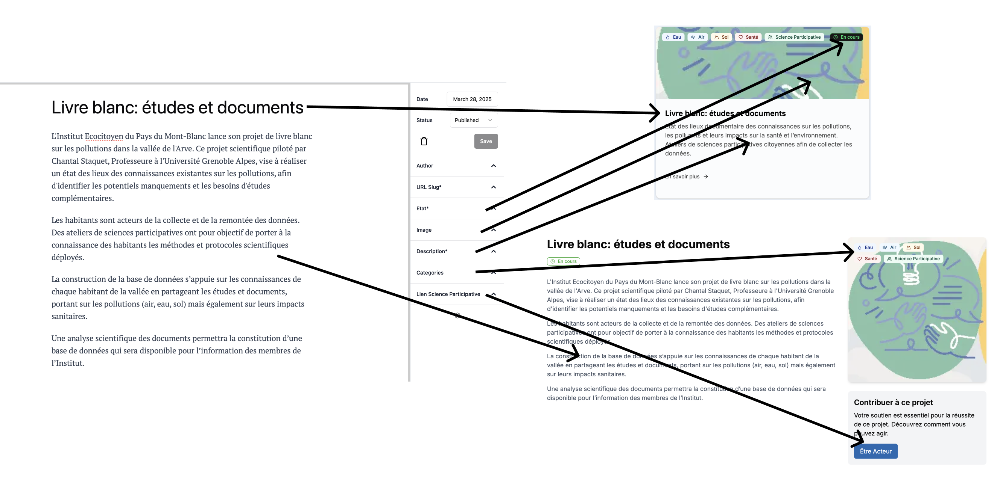

# Institut Ecocitoyen du Pays du Mont Blanc

## Comment mettre à jour le contenu du site web?

### Accès à l'editeur de contenu

L'éditeur de contenu se trouve à l'adresse suivante: https://institut-ecocitoyen-pmb.fr/outstatic.

Seules certaines personnes y ont accès. Pour se faire, suivre la procédure suivante:

1. Créer un compte sur [GitHub](https://github.com/signup)
2. Envoyer le nom d'utilisateur à Mathieu par email
3. Accepter l'invitation reçu par email pour rejoindre l'organisation sur GitHub

Vous pourrez maintenant vous connecter sur l'editeur de contenu.

### Editer du contenu

Il existe plusieurs catégories de contenu, regroupées par "Collection".

Seules 2 sont peuvent être éditées sans soucis (les autres peuvent potentiellement demander des mises à jours du code source du site et sont à voir avec Mathieu):

- les actualitées
- les projets

Chacunes des deux collections contiennent des données structurées qui apparaissent sur le site:

#### Actualité



#### Projet



## Architecture

The public website and its content editor are deployed independently:

- The repository root is a statically exported Next.js site hosted on
  Cloudflare Pages at `https://institut-ecocitoyen-pmb.fr`.
- [`cms/`](./cms) is a minimal dynamic Next.js application hosted as a separate
  Vercel project at `https://cms.institut-ecocitoyen-pmb.fr`.
- Outstatic stores content in this repository under [`outstatic/`](./outstatic).
  Saving content creates a commit, which triggers a new Cloudflare Pages build.
- Spreadsheet edits trigger a Pages build through the Google Apps Script in
  [`integrations/google-sheets/`](./integrations/google-sheets).

The Cloudflare Pages project uses the **Next.js (Static HTML Export)** preset:

```text
Production branch: main
Build command: npm run build
Build directory: out
```

After attaching the production domain, enable Cloudflare Web Analytics for the
site in the Cloudflare dashboard.

The Vercel CMS project uses `cms` as its Root Directory. Copy
[`cms/.env.example`](./cms/.env.example) into the Vercel project environment and
fill in the secrets. The production GitHub OAuth callback is:

```text
https://cms.institut-ecocitoyen-pmb.fr/api/outstatic/callback
```

## Developers

First, run the development server:

```bash
npm run dev
# or
yarn dev
# or
pnpm dev
# or
bun dev
```

Open [http://localhost:3000](http://localhost:3000) with your browser to see the result.

You can start editing the page by modifying `app/page.tsx`. The page auto-updates as you edit the file.

## Learn More

To learn more about Next.js, take a look at the following resources:

- [Next.js Documentation](https://nextjs.org/docs) - learn about Next.js features and API.
- [Learn Next.js](https://nextjs.org/learn) - an interactive Next.js tutorial.

You can check out [the Next.js GitHub repository](https://github.com/vercel/next.js) - your feedback and contributions are welcome!

To run the CMS locally, create `cms/.env.local` from `cms/.env.example`, use a
separate local GitHub OAuth app whose callback is
`http://localhost:3000/api/outstatic/callback`, then run:

```bash
cd cms
npm install
npm run dev
```
